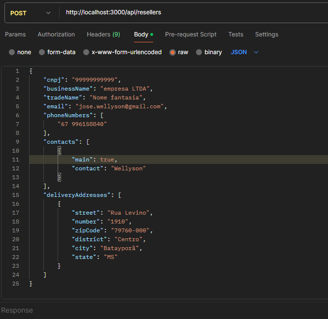
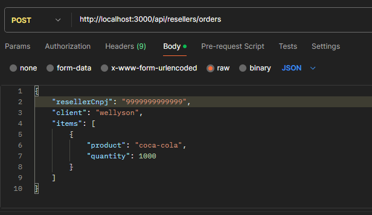
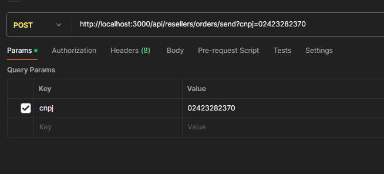

# Reseller Order Processing API

This project is a Spring Boot application that handles orders submitted by resellers, validates information, and integrates with an external API. It includes functionalities such as:

1. Reseller Validation:
   - Verifies if the reseller's CNPJ is valid and registered.
2. Order Reception:
   - Processes orders submitted by resellers, temporarily storing them.
3. Sending Orders to External API:
   - Attempts to send orders to an external API with retry support.
   - Automatic resending of failed orders every 30 minutes.

## 🚀 Project Structure

1. Main Layers
   - **Domain:**
        - Contains entities such as Order, OrderItem, OrderSend, and OrderResponse.
        - Represents the data structures used throughout the application.
   - Service:
        - **ResellerService:**
            - Handles the validation and management of resellers.
        - **OrderService:**
            - Manages the reception and storage of orders.
        - **SendOrderService:**
            - Combines orders from a reseller and sends them to the external API.
        - **ApiService:**
            - Interacts directly with the external API, implementing retry functionality for failures.
   - **Configuration:**
        - Integrates with Spring Retry to automate retrying failed requests.

2. Key Classes and Methods
   - **ResellerService**
       - **Function:**
            - Validates the reseller's CNPJ before processing orders.
       - **Key Methods:**
          - validateReseller(String resellerCnpj): Validates if the reseller is registered.
          - registerReseller(Reseller reseller): Registers new resellers in the system.
   - **OrderService**
        - Function:
            - Receives orders from resellers and organizes them by reseller CNPJ.
   - **Key Methods:**
        - receiveOrder(Order order): Processes the order and returns an OrderResponse.
        - getOrder(String resellerCnpj): Retrieves all orders from a specific reseller.
   - **SendOrderService**
        - **Function:**
            - Collects orders from a reseller and sends them to the external API.
        - **Key Methods:**
            - sendOrderToApi(String cnpj): Validates the CNPJ and sends accumulated orders to the external API.
   **- ApiService**
        - **Function:**
            - Manages interaction with the external API, implementing retry and failure recovery logic.
        - **Key Methods:**
            - sendOrderToApi(OrderSend orderSend): Attempts to send an order with retry support.
            - recover(RuntimeException e, OrderSend orderSend): Handles failed orders and schedules a retry.
            - retryFailedOrders(): Retries failed orders every 30 minutes.
3. Workflow
   1. **Order Reception:**
        - An order is sent by the reseller to the appropriate endpoint.
        - The application validates the CNPJ and order items.
   2. **Temporary Storage:**
        - Valid orders are stored in memory (using Map) based on the reseller's CNPJ.
   3. **Sending to External API:**
        - The application attempts to send the accumulated orders to the API.
        - If the API is unavailable, a retry mechanism is triggered automatically with up to 5 attempts.
   4. **Automatic Retry:**
        - Orders that fail after all attempts are stored for scheduled retries.
        - The application will automatically attempt to resend these orders every 30 minutes.

## ⚙️ Running the Application

1. Prerequisites
   - Java 17+
   - Maven 3.8+
2. How to Run the Application
   1. Clone the repository:
   2. Build and run the application:
      `   mvn clean install
          mvn spring-boot:run`
## 🏗️ Available Endpoints

   - **POST /api/resellers**
        - Register reseller
        - Exemple:
        - 

   - **POST /api/resellers/orders**
        - Receives an order for processing.
        - Exemple:
          - 

   - **POST /api/resellers/orders/send**
        - Sends orders for the reseller to the external API.
        - Request Param: cnpj 
        - Exemple:
        - 

## 🚀 Tests

1. Testing Framework
    - JUnit 5 and Mockito.
2. How to Run Tests
    `   mvn test`
3. Test Coverage
   - **Reseller Validation:** Tests both success and failure scenarios.
   - **API Retry on Failures:** Verifies the retry mechanism and scheduling.
   - **Logging:** Ensures that appropriate log messages are generated in various scenarios.

## 🛠️ Highlights 
   - **Automatic Retry:** Configured with Spring Retry to manage failures in communication with the external API.
   - **Scheduled Retry:** Implemented using @Scheduled to retry failed orders every 30 minutes.
   - **Logging:** Logs key actions, errors, and retries throughout the process.

## ⚙️ Tools used:

* [Intellij](https://www.jetbrains.com/pt-br/idea/) - Source code editor

## 🖇️ Collaborating

* **Wellyson Marques** - *Backend* - [Dev](https://github.com/WellysonM)